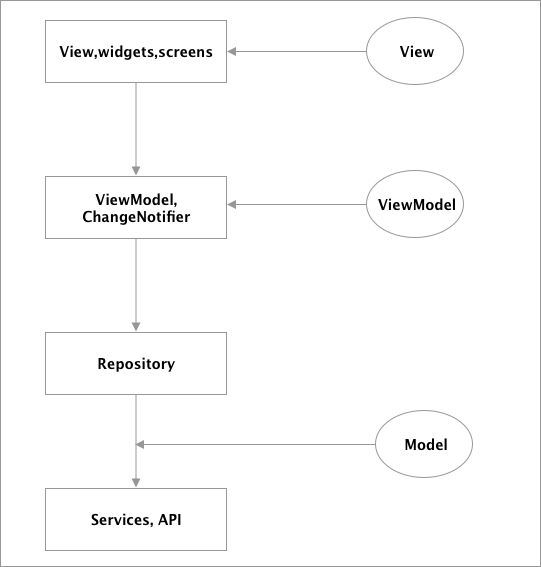
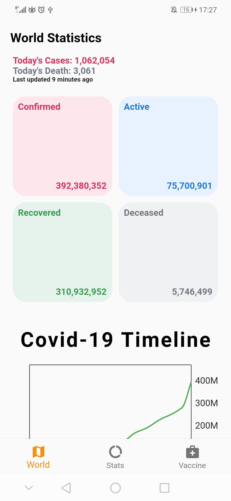
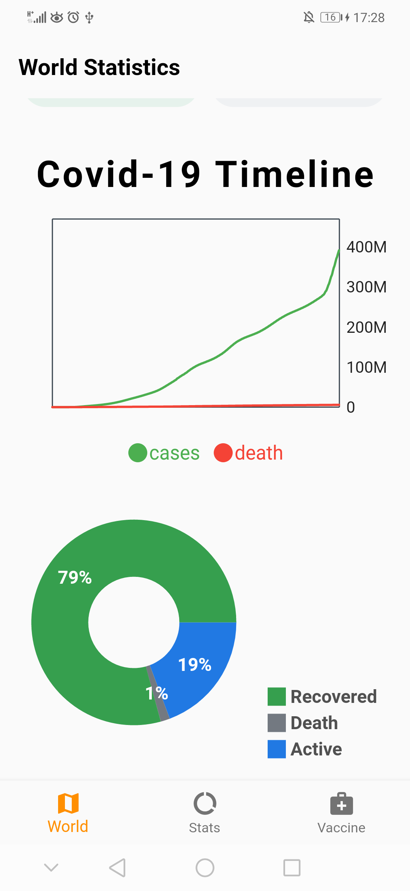
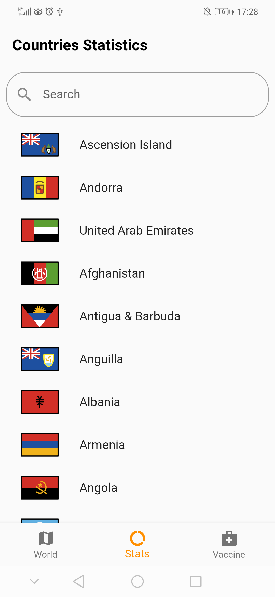

# Covid Tracker
--------

[](https://discord.gg/3t3steGXqN) 


## Architecture

The covid tracker app is used to demonstrate the use of MVVM architecture and clean architecture. The architecture of the app is like the following diagram:



To get more into specifics, in the application the `Provider` state management is used, therefore it is easy to implement the MVVM since the `Provider` has a class called `ChangeNotifierProvider`.

First we have the `View`, which can be any screen or widgets and the only function of the `View` is to show the data on the screen. Then we have the `ViewModel` classes which can extend the `ChangeNotifier` class or use it as a mixin, doing that will allow us to use the method `notifyListener()` which will notify the `ChangeNotifierProviders` for any change, so the `ViewModel` here does not have access to the `View` instead when `notifyListener()` is called, all the objects that are subscribed will be notified of the changes. So this is like the observer pattern.

Then we go to the `Model` part but before explaining that, in the application also I'm using the package `get_it` which is a service locator which means you would have a central registry where you can register the classes and then obtain an instance of those class. Therefore, since I don't want the `ViewModel` classes to know the implementation used in the `Repository` then I use an abstract class and using the `get_it` package I can register the implementation class. But the `ViewModel` classes will always depend on the abstraction instead of the implementation and this will make it easier if you want to change the implementation later on. For example inside the `VaccinationViewModel`:

```dart
  final VaccinationViewRepository _repository = locator<VaccinationViewRepository>();
```

Here, the class registered is `VaccincationViewRepositoryImpl` inside `service_locator.dart` but the `VaccinationViewModel` will have a dependency on `VaccinationViewRepository` thus implementing the 'D' part in `SOLID` principles.

Therefore the `ViewModel` class will call the `Repository` which will also call the `Service` classes, in my case here I used [`retrofit`](https://pub.dev/packages/retrofit) which will lead to many generated files but you can just use [`Dio`](https://pub.dev/packages/dio) instead of `retrofit`. When the data is obtained, it is then returned through each layer from the `Service` classes until the `ViewModel` which calls `notifyListener()` to notify the `View` of the changes.

Finally, I seperated the files by feature instead of adding all the `ViewModel` under a folder called `ViewModel` and all the `Services` under a folder called `Services`... this way it will be easier for navigation.

The API that is used in the application can be found here: https://disease.sh/docs/


## Screens

World Stats Screen 1 | World Stats Screen 2 | Search Screen 1|
:------------:|:-----------:|:--------------:|
|| |

| Search Screen 2 | Country Stats Screen | Vaccine Screen
:--------------:|:--------------:|:--------------:|
| | 

Vaccine Screen 2|
:--------------:|
 |


## How To Run

If you fork the project, then all you have to do is download the dependencies first which you can by executing the command:

```
flutter pub get
```

And then execute:

```
flutter pub run build_runner build
```
To generate all the auto-generated files. 
Also since Google maps is used, then you need to get an [API key](https://developers.google.com/maps/documentation/javascript/get-api-key) to add it to the `Android_manifest.xml` file. For example:

```xml
<application
  ....
<meta-data android:name="com.google.android.geo.API_KEY"
  android:value="API_KEY_HERE"/>
  ....
  </application>
```

## License

Licensed under the [MIT License](https://github.com/PeterHdd/covid_tracker/blob/master/LICENSE).

## Helpful Articles

[Provider Implementation Guide](https://www.filledstacks.com/post/flutter-architecture-my-provider-implementation-guide/) <br>
[Using GetIt in Flutter](https://petercoding.com/flutter/2021/07/21/using-get-it-in-flutter/) <br>
[Making Sense of all those Flutter Providers](https://medium.com/flutter-community/making-sense-all-of-those-flutter-providers-e842e18f45dd) <br>
[Clean Architecture for the rest of us](https://pusher.com/tutorials/clean-architecture-introduction/) <br>
[Using Provider in Flutter](https://petercoding.com/flutter/2021/07/11/using-provider-in-flutter/)

## Support!
Support the repository by joining the [stargazers](https://github.com/PeterHdd/covid_tracker/stargazers) for this repo ⭐

### Created & Maintained By

[Peter](https://github.com/peterhdd) ([@peterndev](https://www.twitter.com/peterndev))

If you found this project helpful or you learned something from the tutorials and want to thank me, consider buying me a cup of :coffee:

<a href="https://www.buymeacoffee.com/peterhaddad" target="_blank"></a>
